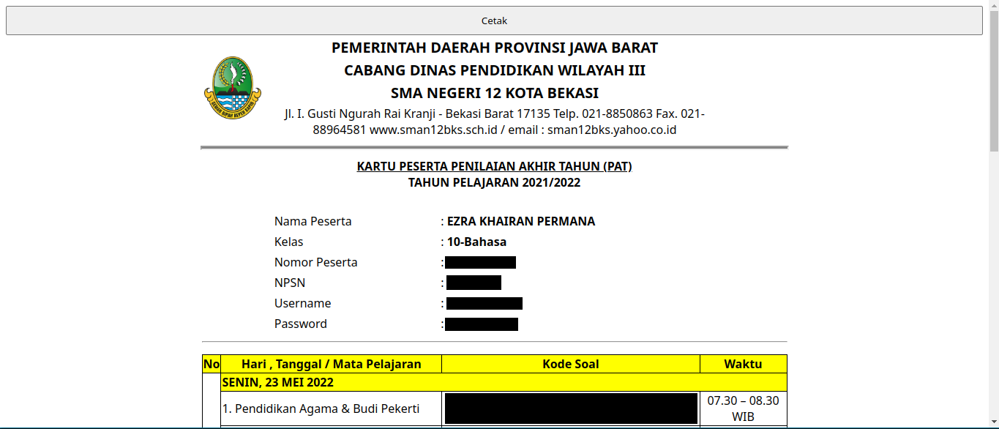
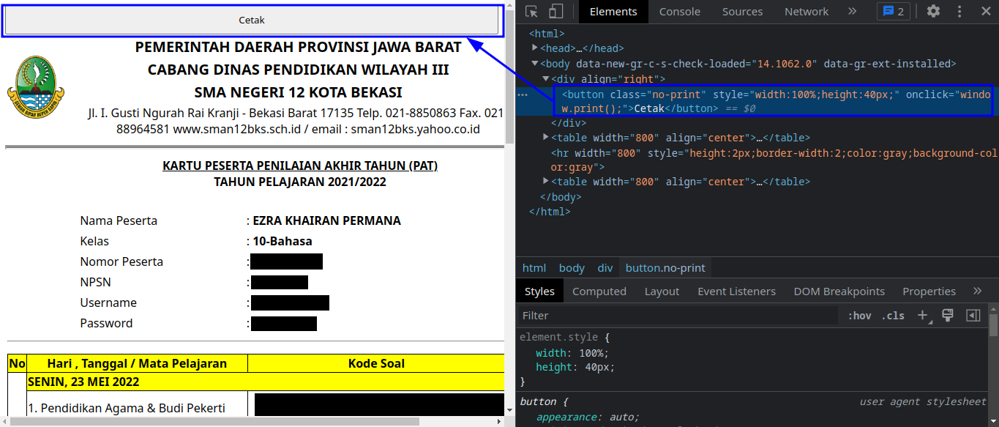
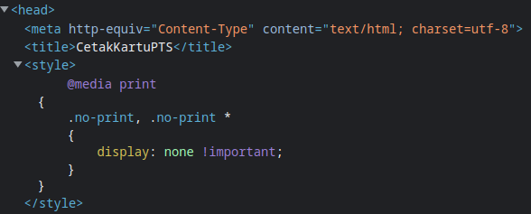
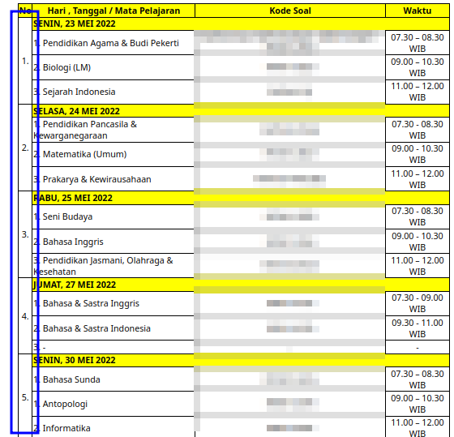
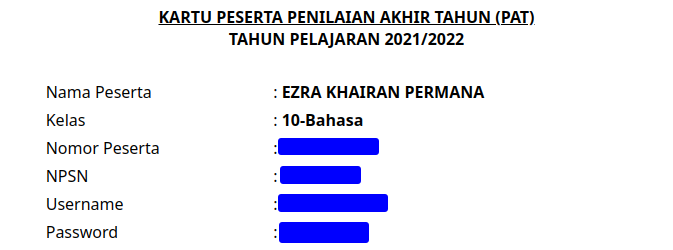

# Konsep Kartu Ujian Digital

Ini adalah penjelasan atas konsep kartu ujian digital yang dapat memudahkan siswa tanpa perlu repot memasukkan NPSN (Nomor Pokok Sekolah Nasional), Username, dan Password. Nantinya jadwal dan token dapat langsung digunakan tanpa perlu mengetikkannya, tetapi tidak akan menggantikan input secara manual ketika token memiliki kesalahan.

Sebelumnya, saya berterima kasih kepada pihak sekolah yang sudah bergerak dengan menggunakan aplikasi sebagai sarana ulangan dan tidak menggunakan kertas sebagai upaya mengurangi dampak kerusakan lingkungan. Disini saya memberikan saran dalam sebuah konsep, berikan saya kritik dan saran serta maafkan jika ada kesalahan dalam bertutur kata.

Dalam kata lain, saya memberikan saran supaya kita lebih _paperless_ dalam melaksanakan ujian.

## Bagaimana Siswa Mendapatkan Kartu Saat Ini?

<br />


Sebelum masuk ke konsep utama, saya sebagai siswa mendapatkan kartu dengan memasukan U-PIN yang diberikan dengan cara verifikasi melalui Whatsapp. Pesan yang ada di Whatsapp akan mengarahkan siswa ke website https://kartuujian.sman12-bekasi.sch.id/ dan mengisikan U-PIN yang tertera.

Setelah tombol `Login` ditekan, akan diarahkan ke halaman kartu yang sebenarnya. Kira-kira tampilannya akan jadi seperti ini.



### Analisis

Ini adalah bagian analisis yang akan memberikan penjelasan bagaimana halaman web kartu bekerja agar memberikan gambaran bagaimana nantinya bisa membuat kartu digital.

#### Bagaimana Kartu Bisa di Download atau di Print

Saya melakukan _inspect element_ ke tombol `Cetak` yang ada, dan ternyata yang dilakukan adalah menjalankan `window.print()` setelah tombol di tekan. Setelahnya akan dimunculkan _popup_ atau _dialogue_ yang menginformasikan ke pengguna untuk menyimpan atau langsung mengeprintnya.



Jika diperhatikan, tombol `Cetak` hilang jika sudah di print/didownload dikarenakan ada class `.no-print` yang cssnya tidak menampilkan pada saat `media print` yang artinya dalam mode printing.



#### Bagaimana Kartu Bisa Terender di Web

Jika dilihat dari URL yang ada di address bar, website dibuat dengan menggunakan php. Hal ini menandakan terdapat sebuah backend dan sebuah database yang menyimpan nama dan identitas siswa beserta jadwal juga token.

```
https://kartuujian.sman12-bekasi.sch.id/cetakskl.php?nisn=<U-PIN>
```

Data akan ditampilkan sesuai apa yang dimasukan sebagai `U-PIN` oleh pengguna. Artinya website ini memiliki template yang sama dan dapat digunakan untuk [_scraping_](https://www.niagahoster.co.id/blog/web-scraping/) dan dapat diambil datanya sebagai data yang bisa digunakan sebagai kartu digital.

## Melakukan Ekstraksi Data

Cara yang paling mudah adalah menggunakan teknik [_scraping_](https://www.niagahoster.co.id/blog/web-scraping/) dari halaman website yang ada. Setelah menyelidiki dan melakukan percobaan, ini teknik yang bisa dilakukan untuk mengambil otomatis yang nantinya bisa di otomasi menggunakan puppeteer.

### Mendapatkan Hari, Mata Pelajaran, Token, dan Waktu

Yang pertama kali saya lakukan adalah mengambil elemen yang merupakan nomor dari kumpulan hari yang ada. Hal ini diambil karena elemen ini memiliki karakteristik khusus yaitu mengisi 4 baris sekaligus (4 rowspan).



Jadi, elemen ini bisa ditampung ke dalam variabel `jadwalRef`.

```js
const jadwalRef = [...document.querySelectorAll('td[rowspan="4"]')];
```

Setelah menampung variabel yang ada, saya melakukan _mapping_ untuk mendapatkan mata pelajaran, token, dan waktu yang sesungguhnya. Untuk mendapatkannya, hal yang paling mungkin adalah melakukan `while loop` yang dapat dihentikan jika sudah mencapai batas tertentu.

Hal yang dilakukan selanjutnya adalah mengecek parent `parentElement` dan mengecek elemen sesudahnya atau `nextElementSibling` apakah tidak ada elemen selanjutnya itu sebuah `'td[rowspan="4"]'`, jika pernyataan itu valid maka di hentikanlah `while loop` dan keluar melanjutkan proses eksekusi kode.

Jika pernyataan itu tidak valid maka kita bisa melakukan pengecekan apakah mata pelajaran bukan merupakan `-`. Dengan aman, kita bisa mengambil mata pelajaran, token dan waktu ulangan.

Untuk mendapatkan informasi tentang tanggal dan hari, kita cukup manfaatkan saja parent element yang terdapat didalam elemen `td`.

Kira-kira kode akan terlihat seperti ini. Penjelasan tambahan tertera pada kode dibawah.

```js
const jadwalRef = [...document.querySelectorAll('td[rowspan="4"]')];

const jadwal = jadwalRef.map((j) => {
  let data = [];
  let currentElement;

  const parent = j.parentElement;

  while (true) {
    // Mengambil element selanjutnya
    const next =
      data.length < 1
        ? parent.nextElementSibling
        : currentElement.nextElementSibling;

    // Apakah elemen selanjutnya tidak ada
    // atau elemen selanjutnya merupakan nomor tabel
    if (!next || next.querySelector('td[rowspan="4"]')) break;

    // Apakah elemen selanjutnya tidak memiliki string "-"
    if (!next.querySelector("td").innerText.includes("-")) {
      const mapelElement = next.querySelector("td");
      const tokenElement = next.querySelector("td:nth-child(2)");
      const waktuElement = next.querySelector("td:nth-child(3)");

      // Mereplace string 1-9<spasi> dengan ''
      const pelajaran = mapelElement.innerText.replace(/[0-9].\s/, "");

      const tokenStr = tokenElement.innerText;

      // Terdapat token yang memiliki beragam opsi.
      // Supaya tetap konsisten, tipe data akan tetap
      // berupa array of string
      const token = tokenStr.includes("/") ? tokenStr.split(" / ") : [tokenStr];

      // Mereplace – (en dash) dengan - (hypen)
      // Karena menyebabkan bug ketika diubah
      // menjadi string json yang disisipkan
      // ke dalam file
      const waktu = waktuElement.innerText.replace("–", "-");

      data.push({
        pelajaran,
        token,
        waktu,
      });
    }

    currentElement = next;
  }

  const hariElement = parent.querySelector("th");

  // Memisahkan antara hari dan tanggal
  const [hari, tanggal] = hariElement.innerText.split(", ");

  return {
    hari,
    tanggal,
    mapel: data,
  };
});
```

### Mendapatkan Identitas Siswa/i



Bagian ini merupakan tabel yang memiliki 800px dan tabel kedua yang ada di jenisnya (`'table[width="800"]:nth-of-type(2)'`). Semua text yang ada dicetak tebal menggunakan tag `b`, jadi bisa di simpulkan bahwa elemen bisa diambil menggunakan `querySelectorAll` dengan parameter `'table[width="800"]:nth-of-type(2) td b'`.

Jika kita gabungkan dengan kode yang sebelumnya, hasilnya akan jadi seperti ini. Penjelasan lebih sudah tercantum dalam kode dibawah ini.

```js
const jadwalRef = [...document.querySelectorAll('td[rowspan="4"]')];
const [nama, kelas, nomorPeserta, npsn, username, password] = [
  ...document.querySelectorAll('table[width="800"]:nth-of-type(2) td b'),
]
  // Di filter apakah merupakan 6 elemen yang dimaksud
  .filter((el) => el.parentElement.getAttribute("colspan") === "2")
  // Akan terdapat spasi, oleh karenya di trim
  // untuk menghilangkan spasi
  .map((el) => el.innerText.trim());

const jadwal = jadwalRef.map((j) => {
  let data = [];
  let currentElement;

  const parent = j.parentElement;

  while (true) {
    // Mengambil element selanjutnya
    const next =
      data.length < 1
        ? parent.nextElementSibling
        : currentElement.nextElementSibling;

    // Apakah elemen selanjutnya tidak ada
    // atau elemen selanjutnya merupakan nomor tabel
    if (!next || next.querySelector('td[rowspan="4"]')) break;

    // Apakah elemen selanjutnya tidak memiliki string "-"
    if (!next.querySelector("td").innerText.includes("-")) {
      const mapelElement = next.querySelector("td");
      const tokenElement = next.querySelector("td:nth-child(2)");
      const waktuElement = next.querySelector("td:nth-child(3)");

      // Mereplace string 1-9<spasi> dengan ''
      const pelajaran = mapelElement.innerText.replace(/[0-9].\s/, "");

      const tokenStr = tokenElement.innerText;

      // Terdapat token yang memiliki beragam opsi.
      // Supaya tetap konsisten, tipe data akan tetap
      // berupa array of string
      const token = tokenStr.includes("/") ? tokenStr.split(" / ") : [tokenStr];

      // Mereplace – (en dash) dengan - (hypen)
      // Karena menyebabkan bug ketika diubah
      // menjadi string json yang disisipkan
      // ke dalam file
      const waktu = waktuElement.innerText.replace("–", "-");

      data.push({
        pelajaran,
        token,
        waktu,
      });
    }

    currentElement = next;
  }

  const hariElement = parent.querySelector("th");

  // Memisahkan antara hari dan tanggal
  const [hari, tanggal] = hariElement.innerText.split(", ");

  return {
    hari,
    tanggal,
    mapel: data,
  };
});

// Ini adalah data yang dapat digunakan
const finalData = {
  user: {
    nama,
    kelas,
    nomor_peserta: nomorPeserta,
    npsn,
    username,
    password,
  },
  jadwal,
};
```

### Typescript Declaration

Kode diatas sudah menunjukkan cara bagaimana dokumen bisa dibuat, tapi supaya dapat memberikan gambaran struktur data yang lengkap, berikut ini merupakan file typescript declaration hasil scraping diatas.

```ts
type UserType = {
  nama: string;
  kelas: string;
  nomor_peserta: string;
  npsn: string;
  username: string;
  password: string;
};

type MapelType = {
  pelajaran: string;
  token: string[];
  waktu: string;
};

type jadwalType = {
  hari: string;
  tanggal: string;
  mapel: MapelType[];
};

export type IDigitalCard = {
  user: UserType;
  jadwal: jadwalType;
};
```

### Menjalankan Scraper

Terdapat sebuah contoh scraper yang menjadi kode dasar yang mungkin kedepannya dapat digunakan.

#### Cloning Dari Github

Jalankan perintah ini Command Line.

```sh
# HTTPS
git clone https://github.com/reacto11mecha/konsep-kartu-ujian-digital.git

# SSH
git clone git@github.com:reacto11mecha/konsep-kartu-ujian-digital.git
```

#### Menginstall package

Anda ke root directory project dan menginstall package yang diperlukan.

```sh
npm install

# atau menggunakan pnpm
pnpm install
```

#### Scraping Web dengan U-PIN

Scraper dapat dijalankan dengan perintah berikut.

```sh
npm run scrape <U-PIN>

# atau

pnpm scrape <U-PIN>
```

Jika berhasil diambil, akan terbentuk folder result didalam folder `result` yang ada di [001-ekstraksi-data](./001-ekstraksi-data/). Akan ada 3 file yang terbentuk, file pdf asli, yang sudah terdapat data kartu, dan data mentahan kartu.

## Membaca Informasi Yang Tedapat Dalam Kartu

Singkatnya dengan snippet dibawah ini, kita dapat membaca mengetahui informasi yang tersembunyi dalam file.

```js
const fs = require("fs");

const pdfBuffer = fs.readFileSync("./to_pdf_file_path.pdf");

const asciiString = fileBuffer.toString("ascii");
const str = asciiString.substring(asciiString.indexOf("%%EOF") + 5);

// Isinya ada disini
const message = str.trim();
```

Jalankan perintah dibawah ini untuk membaca file yang sudah ada di folder result folder ekstraksi data. Di folder [02-membaca-kartu](./002-membaca-kartu/) juga terdapat contoh pembacaan informasi rahasia dengan menggunakan bahasa JavaScript.

```sh
npm run read

# atau

pnpm read
```

## Menambahkan Fungsi Signature dan Verifikasi GnuPG (Opsional)

Jika ingin benar-benar memastikan kartu itu dibuat oleh pihak sekolah, kartu harus memiliki tanda tangan elektronik menggunakan GnuPG (Gnu Privacy Guard) sebagai software penjamin dan bisa diverifikasi dalam aplikasi.

Untuk menandatangani file

```sh
gpg --output <file_asli+extensi>.sig --detach-sig <file_asli+extensi>
```

Untuk memverifikasi keaslian file

```sh
gpg --verify <file_signaturenya> <file_aslinya>
```

Cara diatas merupakan cara manual, terdapat banyak wraper yang sudah ada untuk menangani gpg di banyak bahasa pemrograman.
