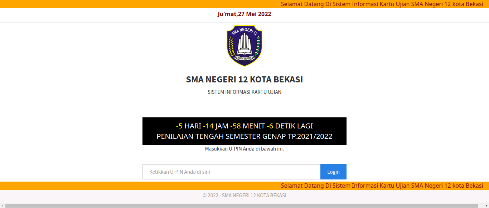

# Konsep Kartu Ujian Digital

Ini adalah penjelasan atas konsep kartu ujian digital yang dapat memudahkan siswa tanpa perlu repot memasukkan NPSN (Nomor Pokok Sekolah Nasional), Username, dan Password. Nantinya jadwal dan token dapat langsung digunakan tanpa perlu mengetikkannya, tetapi tidak akan menggantikan input secara manual ketika token memiliki kesalahan.

Sebelumnya, saya berterima kasih kepada pihak sekolah yang sudah bergerak dengan menggunakan aplikasi sebagai sarana ulangan dan tidak menggunakan kertas sebagai upaya mengurangi dampak kerusakan lingkungan. Disini saya memberikan saran dalam sebuah konsep, berikan saya kritik dan saran serta maafkan jika ada kesalahan dalam bertutur kata.

Dalam kata lain, saya memberikan saran supaya kita lebih _paperless_ dalam melaksanakan ujian.

## Bagaimana Siswa Mendapatkan Kartu Saat Ini?

<br />



Sebelum masuk ke konsep utama, saya sebagai siswa mendapatkan kartu dengan memasukan U-PIN yang diberikan dengan cara verifikasi melalui Whatsapp. Pesan yang ada di Whatsapp akan mengarahkan siswa ke website https://kartuujian.sman12-bekasi.sch.id/ dan mengisikan U-PIN yang tertera.

Setelah tombol `Login` ditekan, akan diarahkan ke halaman kartu yang sebenarnya. Kira-kira tampilannya akan jadi seperti ini.


### Analisis

Ini adalah bagian analisis yang akan memberikan penjelasan bagaimana halaman web kartu bekerja agar memberikan gambaran bagaimana nantinya bisa membuat kartu digital.

#### Bagaimana Kartu Bisa di Download atau di Print

Saya melakukan _inspect element_ ke tombol `Cetak` yang ada, dan ternyata yang dilakukan adalah menjalankan `window.print()` setelah tombol di tekan. Setelahnya akan dimunculkan _popup_ atau _dialogue_ yang menginformasikan ke pengguna untuk menyimpan atau langsung mengeprintnya.


Jika diperhatikan, tombol `Cetak` hilang jika sudah di print/didownload dikarenakan ada class `.no-print` yang cssnya tidak menampilkan pada saat `media screen` yang artinya dalam mode preview.


#### Bagaimana Kartu Bisa Terender di Web

Jika dilihat dari URL yang ada di address bar, website dibuat dengan menggunakan php. Hal ini menandakan terdapat sebuah backend dan sebuah database yang menyimpan nama dan identitas siswa beserta jadwal juga token.

```
https://kartuujian.sman12-bekasi.sch.id/cetakskl.php?nisn=<U-PIN>
```

Data akan ditampilkan sesuai apa yang dimasukan sebagai `U-PIN` oleh pengguna. Artinya website ini memiliki template yang sama dan dapat digunakan untuk [_scraping_](https://www.niagahoster.co.id/blog/web-scraping/) dan dapat diambil datanya sebagai data yang bisa digunakan sebagai kartu digital.

## Melakukan Ekstraksi Data

Cara yang paling mudah adalah menggunakan teknik [_scraping_](https://www.niagahoster.co.id/blog/web-scraping/) dari halaman website yang ada.
